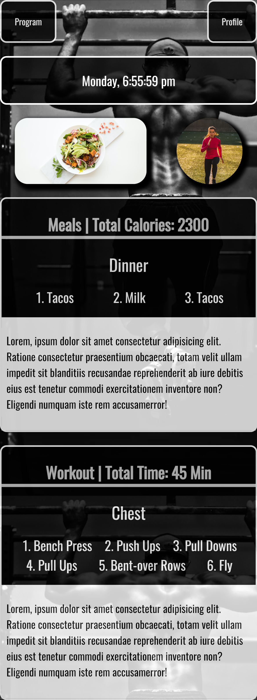

# JS-Flash-Cards

## <section id = "License">License</section>
 N/A
 
## <section id = "Description">Description</section>
A work in progress personal fitness application for mobile phones, which will serve the purpose of providing me with my daily meals, caloric intake, and workouts for the day. Eventually, I would like to make it customizable for other users  to tailor it to their own fitness routine.

Link to application: https://cgotts1.github.io/Fitness-App/

## Table of Contents
1.) <a href = "#License">License</a> 
2.) <a href = "#Description">Description</a> 
3.) <a href = "#Installation">Installation</a>  
4.) <a href = "#Usage">Usage</a> 
5.) <a href = "#Contributing">Contributing</a> 
6.) <a href = "#Tests">Tests</a> 
7.) <a href = "#Questions">Questions</a>

## <section id = "Installation">Installation</section>
Command to Install Dependencies: N/A

## <section id = "Usage">Usage</section>
Using the Repo: N/A

## <section id = "Contributing">Contributing</section>
Contributing to the Repo: N/A

## <section id = "Tests">Tests</section>
Command to Run Tests: N/A

## <section id = "Questions">Questions</section>
If you have any questions, please feel free to contact me:   
1.) Github Username: Cgotts1  
2.) Email Address: cobi.gottschalk@gmail.com